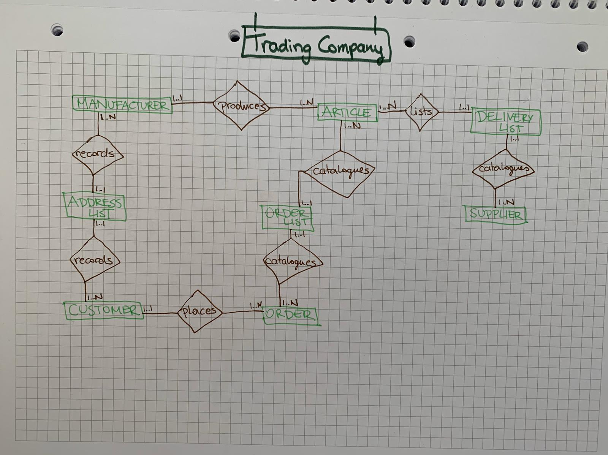
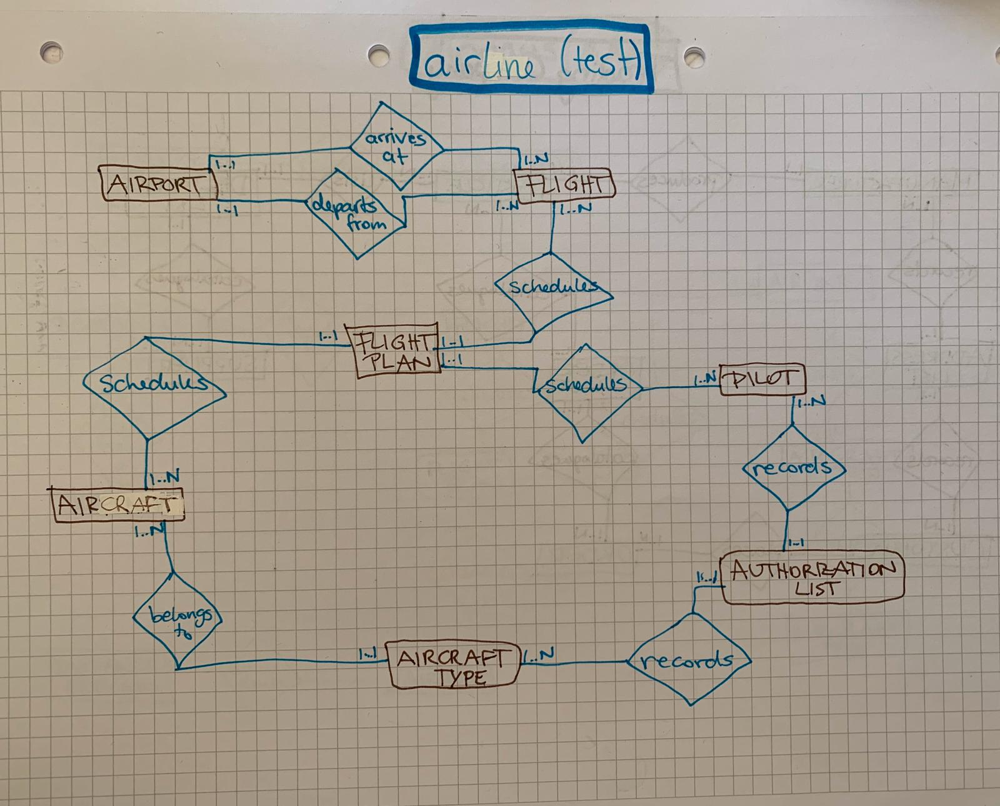

# DB-Test
## Aufgabe 1
Stelle Entitäten mittels Chen-Notation und Min,Max Notation dar.
Wähle ein sinnvolles Beispiel!

## Aufgabe 2
Kann eine Beziehung Attribute haben?
- Ja.
  
Wenn ja, wie stelle ich es im ERD dar?
- Wird als assoziative Tabelle dargestellt. 

## Aufgabe 3
Welche Codd'schen Anforderungen gibt es (Nenne mindestens 5)
- Datensicherung
- Integration
- Synchornisation
- Katalog
- Operationen
- Benutzeransichten
- Integritätssicherung
- Transaktionen
- Zugriffskontrolle

## Aufgabe 4
Nenne den Unterschied zwischen Konzeptuellen und Logischem Schema

## Aufgabe 5
Welche 3 Bestandteile gibt es im Entity Relationship Model
- Entity: Ein Objekt, welches in der Datenbank beschrieben werden soll
- Relationship: die Connection zwischen zwei Entities, z.B. Ein Lehrer unterrichtet ein Fach
- Attribute: sind die Eigenschaften der Entities, z.B. Artikel-Nr, Name, ...
   
## Aufgabe 6
Welche Datentypen gibt es in MySQL? (Nenne mindestens 5)
- Integer, varchar (für Zeichenketten), date, timestamp, double, char, Blob (Binary large object), 
  
## Aufgabe 7
Welche Arten von Schlüsseln gibt es und welche Eigenschaften besitzen diese?
- Primärschlüssel: dient zur eindeutigen Identifikation eines Objekts, z.B. Artikel-Nr., SV-Nr., ...
- Fremdschlüssel: ist ein zweitrangiger Schlüssel in einer Tabelle um auf andere Tabellen zu verweisen und diese zu verbinden. ein Fremdschlüssel muss immer ein Primärschlüssel in jener Tabelle sein auf die er verweist.
  
## Aufgabe 8
Welche Arten von Beziehungen gibt es? Zeichne für jede ein Beispiel auf
- unär: Eine Entität hat eine Beziehung mit sich selbst
- binär: Beziehung zwischen zwei Entitäten
- ternär: Beziehung zwischen drei oder mehr Entitäten

  
## Aufgabe 9
Was bedeutet der Begriff Kardinalität und welche Kardinalitäten gibt es?
- 1:1 Ein Ehepartner hat eine Ehepartnerin
- 1:N Ein Vater hat mehrere Kinder
- N:M Mehrere Reinigungskräfte säubern mehrere Räume
  
## Aufgabe 10
Was bedeutet der Begriff Datenintegrität und worin unterscheidet sich Integrität und referentielle Integrität?
- Integrität bedeutet, dass die richtigen Daten and der richtigen Stelle eingetragen sind. Falsch wäre z.B: einen Namen bei der Spalte Geburtsdatum einzutragen

## Aufgabe 11
Erkläre die 3 Normalformen
- 1. Normalform sorgt dafür, dass die Daten in einer Tabelle aufgelistet werden und jeder Datensatz einen vorgesehen PLatz einnimmt.
- 2. Normalform sorgt dafür, dass keine voll funktionalen Abhängigkeiten bestehen, das heißt, jeder Schlüsselkandidat bekommt seine eigene Tabelle
- 3. Normalform sorgt dafür, dass keine Nicht-Schlüsselattribute von Nicht-Schlüsselattributen abhängig sind. Keine transitiven Abhängigkeiten
  
## Aufgabe 12
Erkläre den Unterschied zwischen starken und Schwachen Entitäten und erstelle ein Beispiel.
- Eine starke Entität kann für sich alleine existieren und ist nicht von anderen abhängig 
- Eine schwache Entität kann nur in Verbindung mit einer anderen existieren.
- Beispiel: Ein Haus kann ohne einen Raum existieren, aber ein Raum nicht ohne ein Haus.
  
## Aufgabe 13
Welche Grundregeln gibt es im Relationenmodell? (Nenne mindestens 4)

## Aufgabe 14
Wie löst man eine M:N Beziehung auf? Erstelle ein Beispiel
- mit einer assoziativen Tabelle
- Beispiel: in einem Bürogebäude gibt es mehrere Reinigungskräfte, die mehrere Räume säubern, daher M:N. Mit einer assoziativen Tabelle--einem Putzplan-- lässt sich festhalten welche Reinigungskraft welchen Raum zu welcher Zeit reinigt. 
  
## Aufgabe 15
Ein Handelsbetrieb verkauft ein Sortiment von Artikeln, die er von verschiedenen Herstellern bezieht. Der Handelsbetrieb hat einen bestimmten Kundenkreis, der regelmäßig Bestellungen aufgibt. Eine Bestellung kann mehrere Artikel umfassen. Ein Artikel kann von mehreren Lieferanten bezogen werden und ein Lieferant liefert natürlich meist mehr als einen Artikel. Erstelle ein ERD und ein Relationenmodell, welches der 3. Normalform entspricht.
- Relationenmodell (updated!):
  - Manufacturer (**manufacturer_id:int**, *adress_id:int*, company_name:varchar(32))
  - Article (**article_nr:int**, *manufacturer_id:int*, *orderlist_id:int*, *delivery_id:int*, designation:varchar(32), stock:int)
  - Customer (**customer_id:int**, *address_id:int*, first_name:varchar(20), last_name:varchar(20), birthday:date, email:varchar(30))
  - Order List (**orderlist_id:int**, order_nr:int, article_nr:int, pieces:int)
  - Supplier (**supplier_id:int**, *delivery_id:int*, first_name:varchar(20), last_name:varchar(20), company:varchar(32))
  - Order (**order_nr:int**, *customer_id:int*, *orderlist_id:int*, sum:double, date_of_invoice:date)
  - Delivery List (**delivery_id:int**, *supplier_id:int*, *article_nr:int*, delivery_date:date)
  - Adressliste (**address_id:int**, zip:varchar(5), city:varchar(20), street:varchar(32), house_number:int, door:int, addition:varchar(32))
  
- ERM:
  - 

- Version 2:
  - 
  
## Aufgabe 16
Welche Anomalien kennst du und was beschreiben sie?
- Insert: kommt vor, wenn falsche oder redundante Daten eingetragen werden
- Update: kommt vor, wenn zur hinzufügen oder aktualisieren mehrere Daten, andere Daten verfälscht werden
- Delete: kommt vor, wenn durch das Löschen von Daten andere Daten ebenfalls gelöscht werden
  
## Aufgabe 17
Modellieren Sie den angeführten Realitätsausschnitt einer Fluggesellschaft mit Hilfe eines Entity Relationship- Diagramms. Treffen Sie, falls notwendig, sinnvolle Annahmen und dokumentieren Sie diese nachvollziehbar in Ihrer Lösung. Der zu betrachtende Realitätsausschnitt der Fluggesellschaft umfasst folgenden
Sachverhalt:
Flughäfen haben ein Kürzel (= Schlüssel) und gehören zu einer Stadt (z.B. „FRA“ für Frankfurt, „FCO“ für Roma Fiumicino).
Flüge haben eine Flugnummer (z.B. „LH 306“), führen von einem Flughafen zu einem anderen, mit jeweils einer festen Abflugs- und Ankunftszeit (z.B. ab Frankfurt um 07:30 nach Roma Fiumicino mit Ankunft um 09:15).
Jeder Flugzeugtyp hat einen Namen (z.B. „747-400“) und eine Sitzanzahl (z.B. 430 Sitze).
Piloten haben einen Namen (z.B. „Meier“), ein Geburtsdatum (z.B. „1.1.1960“) und eine Berechtigung, bestimmte Flugzeugtypen zu fliegen (z.B. „747-400“ und „A310“).
Jedes einzelne Flugzeug ist von einem bestimmten Flugzeugtyp (z.B. „747-400“) und hat einen Namen (z.B. „Mozart“).
Bei einem Flug-Einsatz wird ein Flug (z.B. „LH 306“) an einem bestimmten Datum (z.B. „6.2.2011“) von einem bestimmten Piloten (z.B. „Meier“) mit einem bestimmten Flugzeug (z.B. „Mozart“) geflogen.
Bilden Sie das konzeptuelle Schema in ein relationales Schema ab. Das relationale Schema soll der 3. Normalform genügen

- Relationenmodell (updated!):
  - airport (**airport_id:char(3)**, airport_name:varchar(20), country:varchar(20))
  - flight (**flight_nr:varchar(7)**, *departure_airport:char(3)*, *destination_airport:char(3)*, *plan_id:int*, departure_time:time, arrival_time:time, flight_date:date)
  - aircraft type (**type_id:varchar(10)**, *authorization_id:int*, designation:varchar(20), max_capacity:int, range:double)
  - pilot (**pilot_id:int**, *authorization_id:int*, *plan_id:int*, first_name:varchar(20), last_name:varchar(20), birthday:date, licence:varchar(10), company:varchar(20))
  - authorization list (**authorization_id:int**, pilot_id:int, type_id:varchar(10))
  - aircraft (**aircraft_id:int**, *plan_id:int*, *type_id:varchar(10)*, designation:varchar(20), next_maintenance:date, date_of_entry:date)
  - flight plan (**plan_id:int**, flight_nr:varchar(7), pilot_id:int, aircraft_id:int, flight_date:date)

- ERM
  
   

- version 2

   

